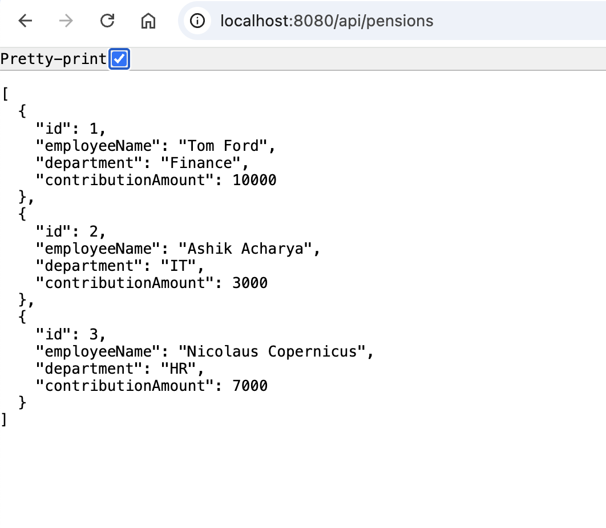

# Pension Application

This is a simple Spring Boot application for managing employee pension contributions. Built with Spring Boot, JPA (Hibernate), and Maven.


## Table of Contents

- [Features](#features)
- [Tech Stack](#tech-stack)
- [Installation](#installation)
- [Usage](#usage)
- [API Endpoints](#api-endpoints)
- [Database Configuration](#database-configuration)
- [Project Structure](#project-structure)
- [License](#license)

---

## Features

- Create, Read, Update, Delete (CRUD) pension records
- RESTful API architecture
- JPA/Hibernate ORM for database operations
- In-memory H2 database (or configurable with MySQL/PostgreSQL)
- Maven build system
- Clean and modular code structure

---

## Tech Stack

- Java 17+
- Spring Boot
- Spring Web
- Spring Data JPA
- H2 Database (or switchable)
- Maven

---

## Installation

### 1. Clone the Repository

```bash
git clone https://github.com/YOUR_USERNAME/Pension-Application.git
cd Pension-Application
```

### 2. Build the Project

```bash
mvn clean install
```

### 3. Run the Application

```bash
mvn spring-boot:run
```

By default, the application runs at:  
`http://localhost:8080`

---

## Usage

You can test the API using tools like **Postman** or **cURL**.

Example pension record:

```json
{
    "id": 1,
    "employeeName": "Ashik Acharya",
    "department": "IT",
    "contributionAmount": 3000
  }
```

---

## API Endpoints

| Method | Endpoint                  | Description                      |
|--------|---------------------------|----------------------------------|
| GET    | `/pensions`               | Get all pension records          |
| GET    | `/pensions/{id}`          | Get pension record by ID         |
| POST   | `/pensions`               | Create a new pension record      |
| PUT    | `/pensions/{id}`          | Update an existing record        |
| DELETE | `/pensions/{id}`          | Delete a pension record by ID    |

---

## Sample cURL Commands

```bash
# Create a new record
curl -X POST http://localhost:8080/api/pensions -H "Content-Type: application/json" -d '{"id":1,"employeeName":"Ashik Acharya","department":"IT","contributionAmount":2500.0}'

# Get all records
curl http://localhost:8080/pensions

# Update a record
curl -X PUT http://localhost:8080/api/pensions -H "Content-Type: application/json" -d '{"id":1,"employeeName":"Ashik Acharya","department":"IT","contributionAmount":500.0}'

# Delete a record
curl -X DELETE http://localhost:8080/pensions/1
```

---

## Project Structure

```
pension-app/
├── src/
│   └── main/
│       ├── java/
│       │   └── com/ashik/pension/
│       │       ├── controller/
│       │       ├── model/
│       │       └── service/
│       └── resources/
│           ├── application.properties
├── pom.xml
├── README.md
└── .gitignore
```

---
## Output Screenshot
[


## Database Configuration

The app uses **H2 in-memory database** by default.

In `src/main/resources/application.properties`:

```properties
spring.datasource.url=jdbc:h2:mem:testdb
spring.datasource.driverClassName=org.h2.Driver
spring.datasource.username=sa
spring.datasource.password=
spring.jpa.database-platform=org.hibernate.dialect.H2Dialect
spring.h2.console.enabled=true
spring.jpa.hibernate.ddl-auto=update
```

To use **MySQL or PostgreSQL**, update the `spring.datasource` configs accordingly.


## License
This project is open-source and available under the [MIT License](https://opensource.org/licenses/MIT).

---

## Author
Ashik Acharya 
